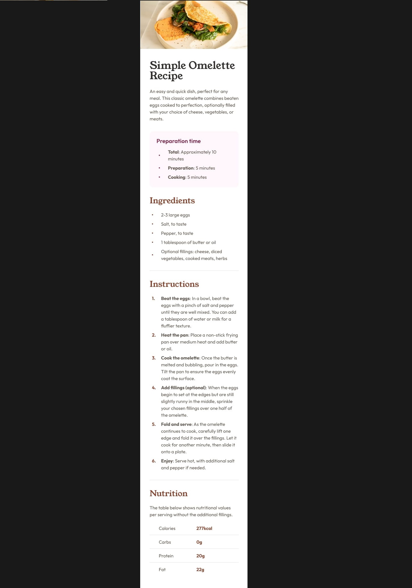

# Recipe Page

This is a solution to the [ on Frontend Mentor]().

## Table of contents

- [Overview](#overview)
  - [The challenge](#the-challenge)
  - [Screenshot](#screenshot)
- [Implementarion](#implementation)
  - [What I learned](#what-i-learned)
  - [Useful resources](#useful-resources)
- [Author](#author)

## Overview

### The challenge

Users should be able to:

- Read clearly the instructions to cook an omelette, in any device both desktop and mobile.

### Screenshot
Desktop Design: 1440 px  

Mobile design: 375 px

## Live URL
- https://utdevolt.github.io/Recipe-Page/

## Implementation

### What I learned
I have more practice about code for mobile responsive. 

### Useful resources:
- https://www.conventionalcommits.org/en/v1.0.0/
- https://www.w3schools.com/tags/tag_hr.asp
- https://www.w3schools.com/howto/howto_css_bullet_color.asp
- https://www.w3schools.com/html/html_tables.asp
## Author
- Dayvid Ramos